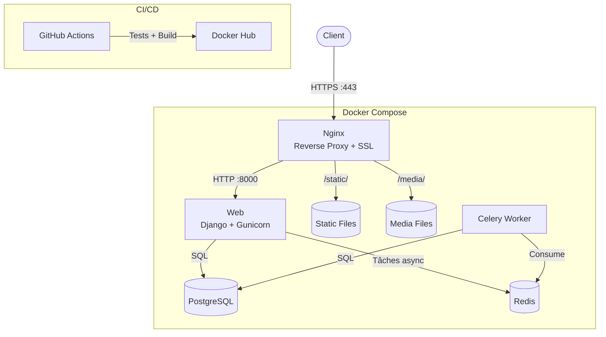

# Nickorp Website

Site web Nickorp — Django, PostgreSQL, Celery, Tailwind CSS, Nginx.

## Architecture



## Fonctionnalités

- **Blog** : articles en Markdown avec image de couverture, tags, brouillon/publié
- **Dashboard** : interface de gestion des articles (superuser uniquement) avec prévisualisation Markdown en temps réel
- **Authentification** : connexion réservée au superuser via `/login/`
- **CI/CD** : tests automatiques + build/push Docker Hub via GitHub Actions

## Prérequis

### Développement
- Python 3.10+
- Node.js 20+
- Docker & Docker Compose

### Production
- VPS avec Docker & Docker Compose
- Nom de domaine avec DNS pointant vers le VPS

## Installation locale

```bash
# Cloner le projet
git clone git@github.com:nicolasdeclerck/nickorp-website.git
cd nickorp-website

# Environnement virtuel Python
python -m venv venv-nickorp-website
source venv-nickorp-website/bin/activate
pip install -r requirements.txt

# Dépendances front
npm install

# Configuration
cp .env.example .env
# Adapter les valeurs si nécessaire (le .env par défaut fonctionne en local)
```

## Développement

```bash
# Lancer PostgreSQL et Redis
docker compose up db redis -d

# Compiler le CSS Tailwind (watch)
npm run dev

# Dans un autre terminal, lancer Django
source venv-nickorp-website/bin/activate
python manage.py migrate
python manage.py createsuperuser
python manage.py runserver
```

Le site est accessible sur http://localhost:8000.

Le superuser permet d'accéder au dashboard via `/login/`.

## Tests

```bash
python manage.py test
```

Les tests couvrent :
- Authentification (login superuser, rejet des users normaux, logout)
- Blog (articles publiés/brouillons, rendu Markdown, slugs)
- Dashboard (CRUD, contrôle d'accès, prévisualisation Markdown)

## Déploiement en production

### 1. Prérequis serveur

Installer Docker et Docker Compose sur le VPS.

Configurer les DNS chez le registrar :

| Type | Nom | Valeur |
|------|-----|--------|
| A | `@` | IP du VPS |
| A | `www` | IP du VPS |

### 2. Cloner le projet sur le VPS

```bash
git clone git@github.com:nicolasdeclerck/nickorp-website.git
cd nickorp-website
```

### 3. Configurer l'environnement

```bash
cp .env.example .env
chmod 600 .env
```

Modifier les valeurs :

```
DJANGO_SECRET_KEY=<clé aléatoire>
DJANGO_DEBUG=False
DJANGO_ALLOWED_HOSTS=nickorp.com,www.nickorp.com
POSTGRES_PASSWORD=<mot de passe solide>
POSTGRES_HOST=db
POSTGRES_PORT=5432
CELERY_BROKER_URL=redis://redis:6379/0
CELERY_RESULT_BACKEND=redis://redis:6379/0
```

### 4. Premier déploiement

```bash
docker compose pull
docker compose up db redis web -d
docker compose exec web python manage.py migrate
docker compose exec web python manage.py createsuperuser
```

### 5. Configurer HTTPS

```bash
./init-ssl.sh
docker compose up -d
```

Le script demande un certificat Let's Encrypt puis active la config Nginx avec SSL.

Le site est accessible sur https://nickorp.com.

### 6. Mises à jour

```bash
docker compose pull
docker compose up -d
docker compose exec web python manage.py migrate
```

L'image Docker est automatiquement build et pushée sur Docker Hub via GitHub Actions à chaque push sur `main` (après validation des tests).
