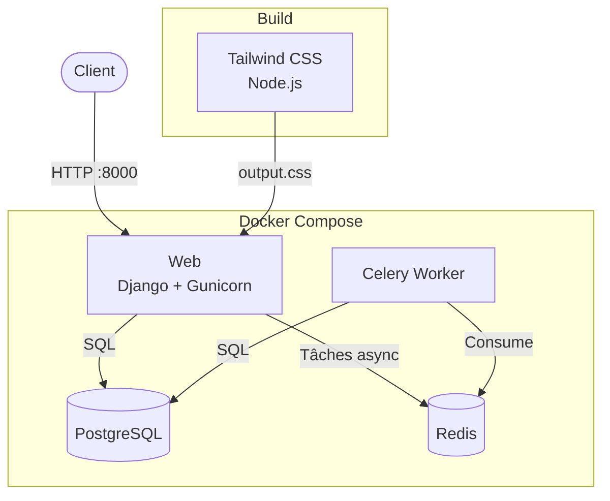

# Nickorp Website

Site web Nickorp — Django, PostgreSQL, Celery, Tailwind CSS.

## Architecture



## Prérequis

- Python 3.10+
- Node.js 20+
- Docker & Docker Compose

## Installation locale

```bash
# Cloner le projet
git clone <repo-url>
cd nickorp-website

# Environnement virtuel Python
python -m venv venv-nickorp-website
source venv-nickorp-website/bin/activate
pip install -r requirements.txt

# Dépendances front
npm install

# Configuration
cp .env.example .env
# Adapter les valeurs si nécessaire (le .env par défaut fonctionne en local)
```

## Développement

```bash
# Lancer PostgreSQL et Redis
docker compose up db redis -d

# Compiler le CSS Tailwind (watch)
npm run dev

# Dans un autre terminal, lancer Django
source venv-nickorp-website/bin/activate
python manage.py migrate
python manage.py createsuperuser
python manage.py runserver
```

Le site est accessible sur http://localhost:8000.

Le superuser permet d'accéder à l'interface d'administration via `/login/`.

## Déploiement en production

### 1. Préparer le serveur

Installer Docker et Docker Compose sur le VPS.

### 2. Copier le projet

```bash
scp -r . user@vps:/chemin/vers/nickorp-website
```

### 3. Configurer l'environnement

Créer le fichier `.env` sur le serveur à partir du template :

```bash
cp .env.example .env
```

Modifier les valeurs :

```
DJANGO_SECRET_KEY=<clé aléatoire>
DJANGO_DEBUG=False
DJANGO_ALLOWED_HOSTS=mon-domaine.fr
POSTGRES_PASSWORD=<mot de passe solide>
POSTGRES_HOST=db
POSTGRES_PORT=5432
CELERY_BROKER_URL=redis://redis:6379/0
CELERY_RESULT_BACKEND=redis://redis:6379/0
```

Sécuriser le fichier :

```bash
chmod 600 .env
```

### 4. Lancer l'application

```bash
docker compose up -d --build
docker compose exec web python manage.py migrate
docker compose exec web python manage.py createsuperuser
```

L'application est accessible sur le port 8000.

Le superuser permet d'accéder à l'interface d'administration via `/login/`. Cette commande est à exécuter une seule fois, après le premier déploiement.
